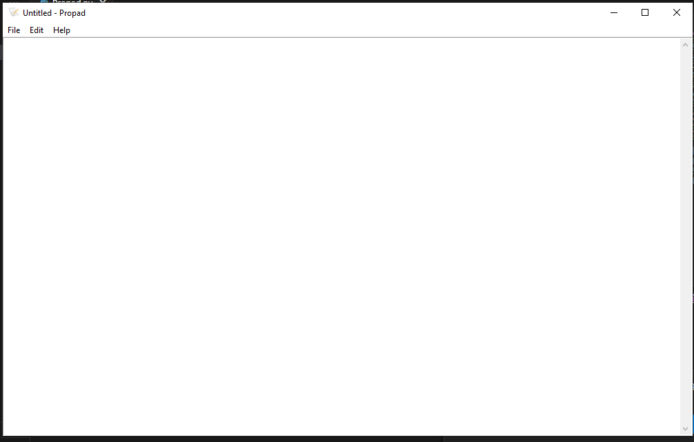

# 📝 Propad - A Simple Text Editor

Propad is a basic text editor built using Python and Tkinter, designed to provide essential text editing functionalities like creating, opening, and saving files, along with cut, copy, and paste options. It's a great project for learning about GUI development in Python! 🚀

## Features ✨

- **New File** 🆕: Start a fresh document.
- **Open File** 📂: Open any existing text file to read or edit.
- **Save File** 💾: Save your current document.
- **Exit** 🚪: Close the application.
- **Edit Options** ✂️📋: Easily cut, copy, and paste text within your document.
- **About Dialog** ℹ️: Learn more about Propad's creator.

## Prerequisites 📦

- **Python 3.x**
- **Tkinter library** (usually included with Python)

## How to Run 🖥️

1. Clone this repository:
    ```bash
    git clone https://github.com/yourusername/propad.git
    cd propad
    ```
2. Run the main Python file:
    ```bash
    python propad.py
    ```

## File Structure 📁

- **`propad.py`**: Main Python file with all the functionalities of the text editor.
- **`Notepad.ico`**: Icon file used for the application window.

## How to Use Propad 🖊️

- **Starting a New File**: Click on `File > New` to clear the text area and begin a new document.
- **Opening a File**: Click on `File > Open`, select a file, and the content will load in the editor.
- **Saving a File**: Click on `File > Save` to save your work. If it's a new file, you will be prompted to provide a file name.
- **Exiting the App**: Click on `File > Exit` to close Propad.
- **Editing Text**: Use `Edit` options to cut, copy, or paste within the text area.

## Screenshots 📸

  
*Example of the Propad interface.*

## Credits 👤

Propad was created by **Shivam Pathak**.

## License 📜

This project is licensed under the GPL License.

